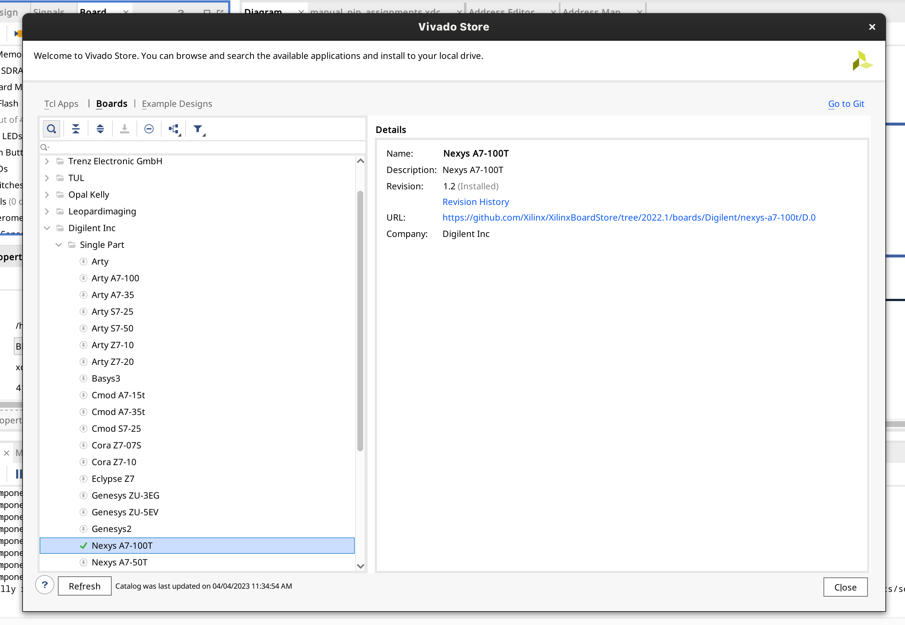
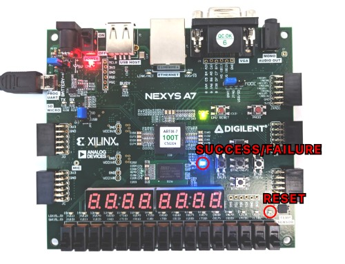

# Overview
This repo hosts the materials for the **OpenHW University Challenge: Exploring CORE-V CVA5 Tightly-Coupled Accelerators for Embedded IoT Applications**.  The focus of this competition is to explore the potential for accelerating applications through CVA5's support for custom execution units.  The teams will compete on creating custom execution units for CVA5, and their efforts will be evaluated based on both their runtime performance and the resource efficiency of their designs across the Embench benchmark suite.

# Setting up the Repo
After checking out the repo run:
```
make extract-reference-binaries
```
to setup the reference-binaries.

## Reference Binaries
Reference binaries are included in: `reference-binaries.tar.xz` in the root directory of the project.  To use them at any point for comparison purposes, run: `make extract-reference-binaries`

## Required Tools
The following is a list of tools used for the baseline system configuration:
 - Nexys A7 board
 - Vivado 2022.1
 - Verilator 4.226+
 - baseline toolchain (compiled with -O2 and defaults otherwise): 
   - GCC 12.2 (rv32im ilp32)
   - Newlib 4.3
 - OpenHW SDK (CORE-V-SDK_Setupv0.0.0.4.run)
   - https://downloads.openhwgroup.org/


# Outline
The remainder of this document contains instructions on
 - Generating the hardware system
 - Using the provided makefile for building and running the benchmarks
 - Using the CORE-V-SDK environment
 - Running benchmarks on the board
 - Running benchmarks in simulation (with Verilator)

For an overview of the CVA5 processor and details on adding custom instructions units please see:
 - [CVA5 overview](docs/cva5-overview.md)
 - [Custom unit support](docs/custom-unit-support.md)

in the docs folder.

# Generating the Hardware System
Two tcl scripts are provided to generate the baseline system for the competition, located in: **cva5/examples/nexys/scripts**

The **cva5-ip-core-base.tcl** script packages the processor for Vivado's IP integrator, and the **system.tcl** script builds the system configuration for the nexys A7 board.

## Presetup
- If you have not already installed the board support for the Nexys 7 board, do so by opening Vivado and going to the menu: "Tools > Vivado Store..."
- You may need to hit the "Refresh" button (lower left of window) to see the full board list.  Right click the **Nexys A7-100T** board and select install.

 

## System Generation
 1. Open Vivado and, from the tcl prompt at the bottom of the screen, navigate to the **cva5/examples/nexys/scripts** folder.
 2. Run: `source cva5-ip-core-base.tcl`
 3. Close the project (menu: **File > Close Project**)
 4. Then run: `source system.tcl` which will create the cva5-competition-baseline project
 5. To generate the bitstream launch the **Generate Bitstream** action which will run synthesis and implementation first.
    - Vivado can require a significant amount of memory, especially during parallel synthesis.  If you are on a memory constrained system, limit the job launcher prompt to a single thread and make sure no synthesis/implementation views are open in Vivado.  Once the project has been created the bitstream can also be generated from the command line without the Vivado GUI if necessary.

Once the bitstream has been generated you can move on to **Running benchmarks on the board** section of this document.

## System Details
 - 100 MHz 
 - 0x80000000 to 0x8FFFFFFF is memory mapped to the I/D caches.
   - DDR at 0x80000000
 - 0x88000000 to 0x8FFFFFFF is used for I/O
   - UART at 0x88000000 (9600 8N1)
   - GPIO at 0x88100000 DIP switches and LEDs (led0 is used to show if the processor is in reset)
   - GPIO at 0x88200000 RGB LEDs

The GPIOs are included to provide additional user status indicators.


# Working with the Makefile
A makefile has been provided that will build the embench benchmarks and can run them, in both a simulation environment (using Verilator) and on the FPGA board.

## Prerequisites
### Building Embench
 - compiler name set in: `embench-iot/config/riscv32/boards/cva5/board.cfg` and in the `Makefile`
   - (riscv32-unknown-elf by default) 
 - make sure your compiler is part of your path (i.e. `export PATH=<path to the bin folder of your toolchain>:$PATH`)

### Running on Hardware
 - Xilinx tools sourced in terminal
 - Connect the USB cable to the PROG/UART port
 - UART terminal open (9600 8N1)

### Running in Simulation
 - verilator included in path

## Makefile Targets
- **extract-reference-binaries** Extracts and copies reference binaries to the build directory
- **build-embench** Builds the embench benchmarks.
- **run-ALL-verilator** Runs the embench benchmarks in the verilator simulation environment. Logs to: logs/ for the summary and to: logs/embench for individual benchmarks.
- **run-ALL-hardware** Runs the embench benchmarks on the board.  Open the UART terminal (9600 8N1) first before running to capture the output.

- **run-\<benchmark name\>-verilator** Runs a single benchmark using verilator
- **run-\<benchmark name\>-hardware** Runs a single benchmark on the board

- **clean** Removes the simulation build

- **lint** Performs a Verilator lint on the CVA5 sources

# Using the CORE-V-SDK/Eclipse Environment
## Prerequisites
 - Same as working with the makefile
 - Ensure that environment variables are set in the terminal from which the SDK is opened.  (i.e. source the Xilinx tools if you will be using the board)

1. Open the CORE-V-SDK
2. import the existing project in the cva5-accelerator directory

## Running/Building
All targets in the makefile are provided as targets in the SDK.

## UART Terminal
1. `Window > Show View > Terminal`
2. Click the `Open a Terminal` button on the Terminal tab
3. Select `Serial Terminal`
   - Options (9600 8N1)
   - (Most likely ttyUSB<#>)

# Running benchmarks on the board
The makefile target will first program the board and then download the binary to memory.  LED0 (the rightmost LED above the DIP switches) will turn on once the board has been programmed and indicates that the system is held in reset.  Once the LED turns off, the benchmark is running.

- Source the vivado shell environment settings
- Ensure the USB cable is connected to PROG/UART on the board and the board is powered on
- Open a 9600 8N1 UART terminal
   -  (note: you can run `ls /dev` before and after plugging in the USB cable to determine the UART port. Most likely: ttyUSB<#>)
   - eg. `minicom -D /dev/ttyUSB1 -b 9600`
- a) `run-ALL-hardware` (to run all benchmarks)
- b) `run-<embench benchmark name>-hardware` to run a single benchmark
    
## Success/Failure indication
The RGB LED on the board (located just to the left of the push buttons), indicates success/failure of the embench self-check in addition to the UART output.
 - Success: Blue
 - Failure: Red




## UART output
Example UART output. Provides runtime (in cycles) and instruction counts for the benchmarks along with the self-test result of the embench benchmark.
Start and End values are the processor's CSR values at the start and end of the profiling period, with User time/inst being the difference between them.

```
Start time: 4438
End time: 4892470
User time: 4888032
Start inst: 1910
End inst: 4544617
User inst: 4542707
IPCx1M: 929352
Result: CORRECT
```

# Running benchmarks in simulation (with Verilator)
The Verilator simulation can be run using the main Makefile or from the Eclipse environment.  The configuration for the simulation can be found in:
 - cva5/examples/nexys/nexys_sim.sv

## Waveform Trace Support
### Optional Prerequisite
 - GTKWave, or other tool for viewing waveforms

To enable waveform tracing when running in the simulation environment, change:
```
TRACE_ENABLE = False
```
to `True` in the Makefile.  Run `make clean` for this change to take effect. A GTKWave config file:`full.gtkw` is provided to add default signals to the trace view.  Only one trace file is created at a time (as they can be quite large), therefore enabling waveform tracing should only be done when running benchmarks individually.

## Example simulation output
A large number of stats are collected to help provide you with an understanding of where the bottlenecks are in each benchmark.  For any event that represents a stall condition, the value is the total number of cycles in which that condition occurred.

```
Fetch---------------------------------------------------------
Early Branch Correction : 0
Sub Unit Stall : 688397
No ID available : 26645
Instruction Cache
  Hits : 7279277
  Misses : 113349
  Arbiter stall : 583
Branch Predictor
  Branches
    Correct : 715787
    Mispredict : 97737
  Returns (RAS)
    Correct : 33255
    Mispredict : 5656
Issue---------------------------------------------------------
Stall Sources
  No Instruction : 4214843
    Max IDs Issued : 0
    Flush : 103311
  Unit Busy : 6659
  Operands Not Ready : 134545
  Hold : 0
  Multi-Source : 82
Operand Stall Waiting On
  Load : 84021
  Multiply : 46
  Divide : 50528
Operands Stall (Branch) : 470
Store with Forwarded Data : 6614
Divider Result Reuse : 11240
Load-Store Unit-----------------------------------------------
Load Blocked by Store : 30865
Sub Unit Stall : 7325
Data Cache
  Hits : 552305
  Misses : 0
  Arbiter stall : 9104
Retire--------------------------------------------------------
Instructions Retired : 6896007
Runtime (cycles) : 11252136
IPC : 0.612862
Instruction Mix
  Basic ALU : 4083369
  Branch or Jump : 852436
  Multiply : 334520
  Divide : 22480
  Load : 552305
  Store : 548976
  Misc : 0

Begin time: 1153066
End time: 12405290
User time: 11252224
Begin inst: 689850
End inst: 7585871
User inst: 6896021
IPCx1M: 612858
Result: CORRECT
```
