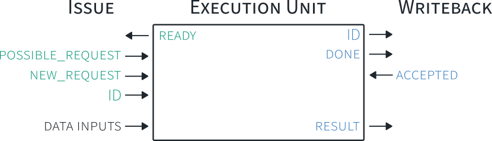

# Adding a Custom Unit
All logic needed to add a your first custom unit is contained within:
 - cva5/core/custom_unit.sv

This includes decode, issue, and writeback support.  Additionally, the unit is already connected, and can be enabled by setting the bit:
```
INCLUDE_CUSTOM : 1
```
in the top-level config struct.  For this competition, the config structs are in `nexys_sim.sv` and `nexys_wrapper.sv` for simulation and hardware respectively.

## custom_unit.sv
The example unit within custom_unit.sv is complete, minimal example of how a custom unit can be implemented.  It has the following properties:
 - It matches one instruction pattern at decode
   - it uses rs1, rs2, and r2
 - It has a latency of 2 cycles
 - It has a throughput of 1 instruction every-other cycle
 - It performs an add of rs1 and rs2 and writes the result to the register-file

## Decode support
The following snippet from `custom_unit.sv`, highlights how decode support is provided within CVA5.  Decode support is distributed among the execution units with each unit being responsible for determining if it is needed.  Additionally, each unit provides whether that instruction needs any register sources or whether it writes to the register-file.
```
    ////////////////////////////////////////////////////
    //Decode
    assign instruction = decode_stage.instruction;

    //The following signals should be asserted when the decoded instruction
    //is handled by this execution unit.
    assign unit_needed = decode_stage.instruction inside {CUSTOM};
    always_comb begin
        uses_rs = '0;
        uses_rs[RS1] = decode_stage.instruction inside {CUSTOM};
        uses_rs[RS2] = decode_stage.instruction inside {CUSTOM};
        uses_rd = decode_stage.instruction inside {CUSTOM};
    end
```
To integrate with the decode logic, a bitvector describing the required bit values for your instruction must be used for the `unit_needed` signal.  You can look at `opcodes.sv` to see how these are defined for the existing RISC-V ISA.  As an example, the `SUB` and `CUSTOM` instruction are shown below:
```
    localparam [31:0] SUB = 32'b0100000??????????000?????0110011;
    localparam [31:0] CUSTOM = 32'b?????????????????????????1111011;
```

## Unit Issue and Writeback interfaces
The diagram below illustrates the issue and writeback interfaces for execution units within CVA5.


Simple handshaking is used for both interfaces to control the flow of instructions.  The signal dependencies are as follows:
 - `ready` before  `new_request`
 - `done` before `ack`

with the `new_request` and `ack` signals being driven by combinational logic.  It is permissable for the `ready` signal to depend on `ack` (see the multipler unit as an example of this).

### Ordering
There are no requirements on instruction ordering within units (or between units).  The only requirement is that the ID is propagated along with its instruction results from issue to writeback.  The unit can send results to writeback in any order it wishes.  If the unit has internal state that is kept between instructions, please refer to the [Retire support and internal state](#sec-retire) section in this document.

### Issue Interface
There is only one output for the issue interface from the execution unit's perspective.  That is the `ready` signal.  When `ready` is one, it indicates that the unit can accept a new request on that cycle.

When a unit receives a `new_request` it also receives a corresponding `ID` for that instruction which must be propagated along with that instruction's results to the writeback stage.

The `possible_request` signal is an optional extra signal used for routing optimization and can be ignored unless you are seeing timing problems with the `new_request` signal.

### Writeback Interface
When an instruction's result has been computed, the unit should assert the `done` signal along with the `result` and the corresponding `ID` of the instruction.  These values should all be held until the writeback stage asserts the `ack` signal.  The response can be, and often is, in the same cycle in which `done` is asserted.

## Signal list
### Issue
 - `ready` 1 when a unit can accept the instruction in the issue stage on this cycle, 0 otherwise.  Can include a combinational path including the `ack` signal from writeback.
 - `possible_request` **(Optional, exists for routing optimization)** indicates that a request exists in the issue stage that uses this unit, but may not be issued due to operand dependencies or a branch flush.  As this signal is determined earlier in a cycle it is useful for enables on memory data-paths to reduce fanout on the `new_request` signal.
  - `ID` The instruction's global ID.  This value must be propagated with the instruction within the execution unit and be set alongside the result at the writeback interface.

### Non-interface Issue signals
 - `issue_stage_ready` the control signal for registering values entering the issue stage from decode
 - `issue_stage` struct containing various registered values from the decode stage.  You can use this to prevent duplicating common logic between units.  (Definition in `cva5_types.sv`)
 - `rf` the issue stage register-file data

### Writeback
 - `done` asserted when an instruction result has been computed and said result is being driven on the `result` signal along with its corresponding `ID`.  `done` must be held, potentially across multiple cycles, until the `ack` signal is asserted.
 - `Result` the data to be written to the register-file
 - `ID` the corresponding ID for the outputed result
 - `ack` asserted in response to `done`. Can be on the same cycle that `done` is asserted, but can come arbitrarily later.

# Design considerations
To aid you in the design of your custom unit(s) here are a few considerations:
 - Use as little logic as possible to determine your `ready` and `done` signals.  Ideally, register them if it doesn't impact your throughput.  As these signals are part of the global control logic, their impact on clock frequency can be large if too complex.  In general, one or two levels of LUTs is acceptable.
 - The processor can only have at most MAX_IDS instructions post-issue at any given time.  As such, if you can provide buffering for that amount of instructions, you can tie the `ready` signal to 1 (i.e. have an input FIFO of depth MAX_IDS).
 - In the issue stage, the register-file data path originates from registers and passes through 1 level of LUTs before arriving at the execution units.  As such, you can easily fit 5-6 additional stages of LUTs or an adder before you register the data inside your unit.
 - The writeback path consists of a priority encoder for the done signals that then muxes the data paths.  A LUTRAM lookup is performed with the muxed ID to obtain the register-file address and the path ends at the register-file (LUTRAM write).  This is why it's important that the `done` signals are available as early as possible in the writeback stage.  However, this means that there is some flexibility in including logic in the data path for the writeback stage.  A few levels of LUTs or an adder should again be fine.
  - As you add more writeback units, the above constraints will become tighter as the muxes increase in size and there is additional routing delay.  If you intend to add a larger number of writeback units, consider adding an additional writeback port.
  - The first connected unit for any writeback port always has the highest priority.  Thus, it can ignore the `ack` signal and assume that its output will be accepted any time it asserts `done`.  If you have a unit that would be made more complex by having to stall (eg. data cache), then consider placing this unit first within its writeback group.


# Retire support and internal state {#sec-retire}
See [cva5-overview](cva5-overview.md) for an introduction to the retire stage of CVA5.  If your unit is going to have internal state that instructions modify and then depend on (eg. an accumulation register that is kept between instructions), any change to that state must only be made architecturally visible once an instruction retires.

If maintaining speculative state is too complex for your unit, to maintain correct behaviour, you will need to **not** accept new instructions that depend on internal state until any instruction that modifies your internal state has retired.

By default, up-to two instructions can retire per-cycle, one of which can be a register-file write. The retire logic is contained in the `instruction_metadata_and_id_management.sv` file.  It outputs the following useful signals:
```
    retire_packet_t retire;
    retire_packet_t store_retire;
    id_t retire_ids [RETIRE_PORTS]
    logic retire_port_valid [RETIRE_PORTS]
```
 - `retire` provides: ID and valid for register-file writes
 - `store_retire` provides: ID and valid for stores
 - `retire_ids` are the two IDs that may be retiring this cycle
 - `retire_port_valid` indicates which ports (if any) are retiring an ID this cycle

You will need to use `retire_ids` and `retire_port_valid` in your design to finalize any changes to architecturally visible internal state.
 
Given that supporting more than one instruction retiring per-cycle can be complicated and expensive, the retire logic can be modified to restrict your instruction type to only one per cycle. (As has already been done for register file writes and stores.)  If this is the approach you would like to follow, please feel free to reach out for assistance in making this kind of change.


# Adding additional custom units
To add additional custom units, two files must be modified:
 - cva5_config.sv
 - cva5.sv
In the config file, you will need to increase the `unit_id_param_t` size, and, optionally, provide config options for your unit.

In `cva5.sv,` you must instantiate your unit, select which writeback port it will connect to and update the following unit ID logic:
```
    ////////////////////////////////////////////////////
    //Unit ID Assignment
    //Generate Issue IDs based on configuration options
    //Then assigned to a struct for ease in passing to sub modules

    //Units with writeback
    localparam int unsigned ALU_UNIT_ID = 32'd0;
    localparam int unsigned LS_UNIT_ID = 32'd1;
    localparam int unsigned CSR_UNIT_ID = LS_UNIT_ID + int'(CONFIG.INCLUDE_CSRS);
    localparam int unsigned MUL_UNIT_ID = CSR_UNIT_ID + int'(CONFIG.INCLUDE_MUL);
    localparam int unsigned DIV_UNIT_ID = MUL_UNIT_ID + int'(CONFIG.INCLUDE_DIV);
    localparam int unsigned CUSTOM_UNIT_ID = DIV_UNIT_ID + int'(CONFIG.INCLUDE_CUSTOM);
    //Non-writeback units
    localparam int unsigned BRANCH_UNIT_ID = CUSTOM_UNIT_ID + 1;
    localparam int unsigned IEC_UNIT_ID = BRANCH_UNIT_ID + 1;

    //Total number of units
    localparam int unsigned NUM_UNITS = IEC_UNIT_ID + 1; 

    localparam unit_id_param_t UNIT_IDS = '{
        ALU : ALU_UNIT_ID,
        LS : LS_UNIT_ID,
        CSR : CSR_UNIT_ID,
        MUL : MUL_UNIT_ID,
        DIV : DIV_UNIT_ID,
        CUSTOM : CUSTOM_UNIT_ID,
        BR : BRANCH_UNIT_ID,
        IEC : IEC_UNIT_ID
    };
```
All units that write to the register file should be added before those that do not (such as the branch and Interrupt and Exception Control).

# Adding additional register-file read-ports
By default, two register source ports are provided.  To increase the number of read ports, the following code will need to be modified:

---
Change to desired number of read ports and define RS3+.

**cva5_config.sv**
```
    localparam REGFILE_READ_PORTS = 2; //min 2, for RS1 and RS2. (Non-powers of two supported)
    typedef enum bit {
        RS1 = 0,
        RS2 = 1
    } rs1_index_t;
```
---
Inside of the main decode logic assign address bits to your additional register ports.
**decode_and_issue.sv**
```
    always_comb begin
        decode_rs_addr = '{default: '0};
        decode_rs_addr[RS1] = decode_instruction.rs1_addr;
        decode_rs_addr[RS2] = decode_instruction.rs2_addr;
    end
```


**custom_unit.sv**
Add the conditions under which your instruction needs RS3+
```
    always_comb begin
        uses_rs = '0;
        uses_rs[RS1] = decode_stage.instruction inside {CUSTOM};
        uses_rs[RS2] = decode_stage.instruction inside {CUSTOM};
        uses_rd = decode_stage.instruction inside {CUSTOM};
    end
```